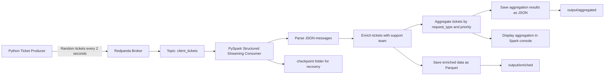

# Customer Ticket Streaming Pipeline with Redpanda and PySpark

## 1. Project Overview

This project is a Proof of Concept (POC) for a real-time customer ticket management pipeline.

The objective is to simulate customer support tickets, ingest them in real time through Redpanda, process them with PySpark Structured Streaming, enrich the data, generate analytical insights, and export the results for later visualization.

This project was developed for the OpenClassrooms exercise:

**Exercice 2 - Gérez des tickets clients avec Redpanda et PySpark**

---

## 2. Business Context

InduTech wants to test a real-time data pipeline for customer support tickets.

Each ticket contains:

- Ticket ID
- Client ID
- Creation date and time
- Customer request
- Request type
- Priority

The company has migrated to AWS and Redpanda, so the goal of this POC is to simulate a Redpanda-based streaming architecture locally using Docker.

---

## 3. Project Goals

The project implements the following requirements:

- Configure a Redpanda broker to ingest ticket data in real time.
- Create a Redpanda topic named `client_tickets`.
- Generate random customer tickets using a Python producer.
- Read streaming data from Redpanda using PySpark.
- Parse and transform the ticket data.
- Assign a support team based on the request type.
- Generate analytical insights by aggregating tickets by request type and priority.
- Export enriched data to Parquet files.
- Export aggregation results to JSON files.
- Use Docker and Docker Compose to run the full pipeline.
- Document the architecture with a Mermaid diagram.
- Provide a short demo video explaining how to use the POC.

---

## 4. Technologies Used

| Technology | Role |
|---|---|
| Python 3 | Used for the ticket producer |
| Faker | Generates fake ticket data |
| Confluent Kafka Python client | Sends messages to Redpanda |
| Redpanda | Kafka-compatible streaming platform |
| PySpark | Reads, transforms, and analyzes streaming data |
| Spark Structured Streaming | Continuous streaming processing using micro-batches |
| Parquet | Storage format for enriched ticket data |
| JSON | Storage format for aggregated analytical results |
| Docker | Containerizes the different components |
| Docker Compose | Orchestrates the full project |
| Redpanda Console | Web UI for monitoring topics and messages |

---

## 5. Architecture

The pipeline follows this flow:

```text
Python Producer
      ↓
Redpanda topic: client_tickets
      ↓
PySpark Structured Streaming Consumer
      ↓
Data enrichment + aggregation
      ↓
Parquet output + JSON analytical reports
```

---

## 6. Data Pipeline Diagram



---

## 7. Project Structure

```text
redpanda_ticket_project/
├── docker-compose.yml
├── README.md
├── producer/
│   ├── Dockerfile
│   ├── requirements.txt
│   └── ticket_producer.py
├── spark/
│   ├── Dockerfile
│   ├── requirements.txt
│   └── spark_consumer.py
├── output/
│   ├── enriched/
│   └── aggregated/
└── checkpoint/
    ├── enriched/
    └── aggregated_json/
```

Important note:

The `output/` and `checkpoint/` folders are generated automatically when the pipeline runs. They do not need to exist before starting the project.

---

## 8. Main Components

### 8.1 Redpanda

Redpanda is used as the streaming broker.

It is Kafka-compatible, which means Spark and the Python producer can communicate with it using Kafka APIs.

The Redpanda service exposes:

| Port | Purpose |
|---|---|
| `9092` | Internal Kafka API used by Docker containers |
| `19092` | External Kafka API used from the host machine |
| `9644` | Redpanda Admin API |

Inside Docker, services connect to Redpanda using:

```text
redpanda:9092
```

From the host machine, local tools can connect using:

```text
localhost:19092
```

---

### 8.2 Explicit Topic Creation

The topic `client_tickets` is created automatically by the `redpanda-init` service in `docker-compose.yml`.

The topic is created with:

```text
3 partitions
1 replica
```

The command used is:

```bash
rpk topic create client_tickets \
  --brokers redpanda:9092 \
  --partitions 3 \
  --replicas 1 \
  --if-not-exists
```

Explanation:

| Part | Meaning |
|---|---|
| `rpk` | Redpanda command-line tool |
| `topic create` | Creates a new topic |
| `client_tickets` | Name of the topic |
| `--brokers redpanda:9092` | Connects to the Redpanda broker inside Docker |
| `--partitions 3` | Creates 3 partitions for the topic |
| `--replicas 1` | Uses one replica because this is a single-node local POC |
| `--if-not-exists` | Avoids failure if the topic already exists |

---

### 8.3 Python Ticket Producer

The producer generates one random ticket every 2 seconds and sends it to the Redpanda topic `client_tickets`.

Each ticket contains the following fields:

| Field | Description |
|---|---|
| `ticket_id` | Unique ticket identifier |
| `client_id` | Random client identifier |
| `created_at` | Ticket creation timestamp |
| `request` | Random customer request text |
| `request_type` | Type of request |
| `priority` | Ticket priority |

Example ticket:

```json
{
  "ticket_id": "b7e3d2f4-7a23-4d3b-9f3a-7d83c2e48a11",
  "client_id": 4721,
  "created_at": "2026-04-24T13:58:11",
  "request": "Need help with account access.",
  "request_type": "technical",
  "priority": "high"
}
```

The producer uses:

```python
producer.produce(...)
```

This sends the message asynchronously to Redpanda.

The producer also uses a delivery callback to confirm that messages are successfully delivered.

---

### 8.4 PySpark Consumer

The PySpark consumer reads streaming data from the Redpanda topic using Spark Structured Streaming.

It performs the following steps:

1. Connects to Redpanda.
2. Reads messages from the `client_tickets` topic.
3. Converts the Kafka message value from binary to string.
4. Parses the JSON message using a predefined schema.
5. Filters invalid records.
6. Adds a support team based on the request type.
7. Converts the creation timestamp into a proper date/timestamp.
8. Saves enriched ticket data as Parquet.
9. Aggregates tickets by request type and priority.
10. Saves aggregation results as JSON.
11. Displays live aggregation results in the console.

---

## 9. Data Transformations

The main enrichment step assigns a support team based on the request type.

| Request Type | Assigned Support Team |
|---|---|
| `technical` | Tech Team |
| `billing` | Finance Team |
| `account` | Accounts Team |
| `general` | General Team |

Example:

```text
technical → Tech Team
billing   → Finance Team
account   → Accounts Team
general   → General Team
```

---

## 10. Aggregations and Insights

The Spark consumer calculates the number of tickets grouped by:

```text
request_type
priority
```

Example output:

```text
+------------+--------+------------+
|request_type|priority|ticket_count|
+------------+--------+------------+
|technical   |high    |32          |
|billing     |medium  |40          |
|account     |low     |27          |
|general     |high    |44          |
+------------+--------+------------+
```

This provides a simple operational insight into the distribution of support tickets by category and urgency.

---

## 11. Output Folders

When the pipeline runs, Spark automatically creates an `output/` folder.

```text
output/
├── enriched/
└── aggregated/
```

### 11.1 `output/enriched/`

This folder contains the enriched ticket data in Parquet format.

The enriched data includes:

```text
ticket_id
client_id
created_at
request
request_type
priority
support_team
created_timestamp
created_date
```

This output proves that Spark successfully processed and enriched the streaming data.

---

### 11.2 `output/aggregated/`

This folder contains the aggregation results in JSON format.

Spark writes the aggregation results by micro-batch.

Example structure:

```text
output/aggregated/
├── epoch_0/
├── epoch_1/
├── epoch_2/
└── epoch_3/
```

Each `epoch_x` folder represents one Spark streaming micro-batch.

Example JSON result:

```json
{"request_type":"technical","priority":"high","ticket_count":32}
{"request_type":"billing","priority":"medium","ticket_count":40}
```

---

## 12. Checkpoint Folder

Spark also creates a `checkpoint/` folder.

```text
checkpoint/
├── enriched/
└── aggregated_json/
```

This folder is used internally by Spark Structured Streaming.

It stores:

- Kafka offsets
- Streaming progress
- Aggregation state
- File sink metadata

The checkpoint folder improves resilience. If the Spark container stops and restarts, Spark can continue from the last processed messages instead of starting again from zero.

In simple terms:

```text
output/      = business and analytical results
checkpoint/  = technical recovery information used by Spark
```

The `checkpoint/` folder should not be edited manually.

---

## 13. Why Spark Structured Streaming with Micro-Batches?

This project uses Spark Structured Streaming.

Spark continuously reads from the Redpanda topic, but it processes the incoming records in small repeated micro-batches.

This is why the logs show messages such as:

```text
Batch: 58
```

This does not mean the pipeline is a classic one-time batch job.

It is a streaming job using micro-batch processing.

This approach was chosen because:

- It is the standard Spark approach for streaming analytics.
- It is suitable for near real-time processing.
- It works well for aggregations such as ticket counts.
- It works well with file outputs such as Parquet and JSON.
- It supports checkpointing and recovery.
- It is stable and appropriate for a local Docker-based POC.

This project does not require millisecond-level event processing. The goal is to ingest tickets in real time and generate analytical insights continuously, which Spark Structured Streaming supports well.

---

## 14. Redpanda Partitions vs Spark Shuffle Partitions

This project uses two different types of partitions.

| Type | Value | Where It Is Defined | Purpose |
|---|---:|---|---|
| Redpanda topic partitions | `3` | `rpk topic create --partitions 3` | Splits messages inside the Redpanda topic |
| Spark shuffle partitions | `4` | `SPARK_SQL_SHUFFLE_PARTITIONS=4` | Controls Spark internal aggregation parallelism |

These are not the same thing.

Redpanda partitions control how messages are distributed inside the topic.

Spark shuffle partitions control how Spark reorganizes data internally during operations such as:

```text
groupBy
count
aggregation
join
```

For this local POC, Spark shuffle partitions were reduced from the default value to keep the execution lightweight.

---

## 15. Docker Services

The Docker Compose file starts the following services:

| Service | Role |
|---|---|
| `redpanda` | Streaming broker |
| `redpanda-init` | Waits for Redpanda and creates the topic |
| `console` | Redpanda Console web UI |
| `producer` | Generates and sends fake tickets |
| `spark` | Reads, processes, aggregates, and exports data |

---

## 16. How to Run the Project

### 16.1 Prerequisites

You need:

- Docker
- Docker Compose

Check Docker:

```bash
docker --version
docker compose version
```

---

### 16.2 Pull Redpanda Images

Optional but recommended:

```bash
docker compose pull redpanda redpanda-init console
```

Or pull everything possible:

```bash
docker compose pull
```

---

### 16.3 Build and Start the Pipeline

From the project root folder, run:

```bash
docker compose up --build
```

This command will:

1. Start Redpanda.
2. Start `redpanda-init`.
3. Create the `client_tickets` topic.
4. Start Redpanda Console.
5. Start the Python producer.
6. Start the PySpark consumer.
7. Generate output and checkpoint folders.

---

### 16.4 Access Redpanda Console

Open the following URL in your browser:

```text
http://localhost:8080
```

You can use Redpanda Console to inspect:

- Topics
- Messages
- Partitions
- Consumer groups

---

## 17. Useful Verification Commands

### Check running containers

```bash
docker compose ps
```

---

### List Redpanda topics

```bash
docker exec -it redpanda rpk topic list --brokers redpanda:9092
```

---

### Describe the `client_tickets` topic

```bash
docker exec -it redpanda rpk topic describe client_tickets --brokers redpanda:9092
```

---

### Consume a few messages manually

```bash
docker exec -it redpanda rpk topic consume client_tickets \
  --brokers redpanda:9092 \
  --num 5
```

---

### Check generated output folders

```bash
ls -R output
```

---

## 18. How to Stop the Pipeline

If the pipeline is running in the terminal, press:

```text
CTRL + C
```

Then run:

```bash
docker compose down
```

---

## 19. Clean Restart for a Fresh Demo

To restart from a clean state before recording a demo video:

```bash
docker compose down -v --remove-orphans
rm -rf output checkpoint
docker compose up --build
```

This removes:

- Old containers
- Docker volumes
- Previous Spark output files
- Previous Spark checkpoints

After restarting, Spark will recreate the `output/` and `checkpoint/` folders automatically.

---

## 20. Resilience

The project includes several resilience mechanisms.

### Producer-side resilience

The producer uses a delivery callback to confirm that messages are delivered to Redpanda.

It also uses `flush()` when shutting down to reduce the risk of losing messages still waiting in the local producer buffer.

### Spark-side resilience

Spark uses checkpointing.

The checkpoint folder allows Spark to recover:

- Kafka offsets
- Streaming progress
- Aggregation state

This means the Spark streaming job can continue from the last committed progress after a restart.

---

## 21. Performance Considerations

This is a local POC, so the configuration is intentionally lightweight.

The Redpanda broker runs as a single-node development broker.

The topic uses:

```text
3 partitions
1 replica
```

The Spark consumer uses a reduced number of shuffle partitions:

```text
SPARK_SQL_SHUFFLE_PARTITIONS=4
```

This avoids the overhead of Spark’s default shuffle partition count, which is too high for a small local project.

The goal is not to build a production cluster, but to demonstrate a complete streaming pipeline in a reproducible local environment.

---

## 22. Generated Data Example

Example ticket generated by the producer:

```json
{
  "ticket_id": "e8a58281-d1af-4ad4-be90-d4ba97885abd",
  "client_id": 5231,
  "created_at": "2026-04-24T13:58:11",
  "request": "Need help updating account settings.",
  "request_type": "account",
  "priority": "low"
}
```

After Spark enrichment:

```json
{
  "ticket_id": "e8a58281-d1af-4ad4-be90-d4ba97885abd",
  "client_id": 5231,
  "created_at": "2026-04-24T13:58:11",
  "request": "Need help updating account settings.",
  "request_type": "account",
  "priority": "low",
  "support_team": "Accounts Team",
  "created_timestamp": "2026-04-24T13:58:11",
  "created_date": "2026-04-24"
}
```

---

## 23. Demo Video

A short demo video was recorded to show:

- Starting the pipeline with Docker Compose
- Redpanda running successfully
- The producer sending tickets
- Spark consuming and aggregating messages
- The generated `output/` folder
- The generated `checkpoint/` folder
- The exported JSON and Parquet outputs

Demo video link:

```text
https://www.youtube.com/watch?v=d_n4LS_sEjk
```

---

## 24. Troubleshooting

### Problem: Spark continues from old data

This happens because Spark uses checkpoints.

Solution:

```bash
docker compose down -v --remove-orphans
rm -rf output checkpoint
docker compose up --build
```

---

### Problem: Topic already exists

This is normal.

The topic creation command uses:

```bash
--if-not-exists
```

So the command will not fail if the topic already exists.

---

### Problem: Redpanda is not ready when producer starts

The `redpanda-init` service waits until Redpanda is ready before creating the topic.

The producer and Spark services should depend on `redpanda-init`, so they start only after the topic is ready.

---

### Problem: `output/` or `checkpoint/` folders do not exist

These folders are created automatically by Spark only after the streaming job starts successfully.

Start the project with:

```bash
docker compose up --build
```

Then wait a few seconds for Spark to process data.

---

## 25. Suggested `.gitignore`

The following files and folders can be ignored:

```gitignore
output/
checkpoint/
__pycache__/
*.pyc
.DS_Store
```

The `output/` and `checkpoint/` folders are generated automatically and do not need to be committed to the source repository.

---

## 26. Conclusion

This project demonstrates a complete near real-time streaming pipeline using Redpanda and PySpark.

The pipeline successfully:

- Generates random customer tickets.
- Sends them to a Redpanda topic.
- Reads them continuously with Spark Structured Streaming.
- Enriches the data with support team assignment.
- Aggregates tickets by request type and priority.
- Exports enriched data to Parquet.
- Exports analytical results to JSON.
- Uses checkpointing for recovery.
- Runs fully with Docker Compose.

This POC satisfies the main requirements of the exercise and provides a reproducible foundation for a real-time customer ticket analytics system.

